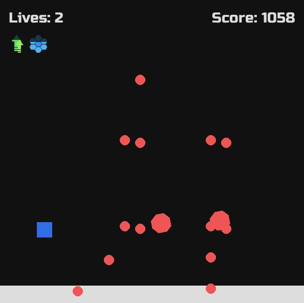

# Obstacube

A retro-styled arcade game made in Pygame. You play as a little cube in a slightly larger, obstacle-filled world. Dodge, jump, and power up to surive this onslaught and reach new high scores!

## Usage
1. Clone this repository with `git clone https://github.com/Zetta56/Obstacube.git`
2. Install all dependencies with `pip install`
3. Run `python main.py`